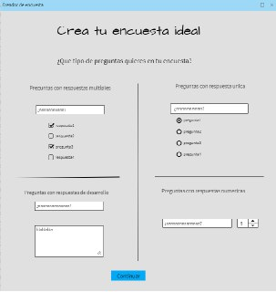
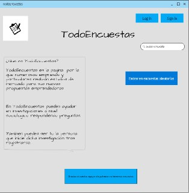
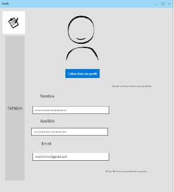

##Todo encuestas 
###Hecho solo por Adrián Muñoz
####Herramientas;

Mockflow para el mockup
Es un programa online muy sencillo con la capacidad de hacer un mockup muy bien elaborado.
Haroopad para markdown
Es un programa que no requiere unas grandes capacidades por parte del hardware. Muy practico y con gran fluidez en su uso.
####Bibliografía [Guia de Markdown](https://markdown.es/sintaxis-markdown/) 
##mockup

